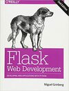

# Flask Project Scaffold

Copy of code from this book



[Flask Web Development, 2nd - O'Reilly 2018](https://www.amazon.com/Flask-Web-Development-Developing-Applications/dp/1491991739/)

Chapter 7 "Large Application Structure"

## Usage

- Clone this git repo
- Copy `proj` dir to your proj dir, and rename properly
- Create `venv` and activate it
  - `python -m venv venv --prompt flask`
  - `venv\Scripts\activate`
  - `python -m pip install pip --upgrade`
- Install packages `pip install -r requirements.txt`
- set env `FLASK_APP="flask_app"`, `FLASK_ENV="development"`
- Upgrade DB `flask db upgrade`
- Run `flask run`

### Project Structure

```text
|-app/
    |-templates/
    |-static/
    |-main/
        |-__init__.py
        |-errors.py
        |-forms.py
        |-views.py
    |-__init__.py
    |-models.py
    |-email.py
|-migrations/
|-tests/
    |-__init__.py
    |-test*.py
|-venv/
|-requirements.txt
|-config.py
|-flask_appy.py

```

`flask_scaffold.py` create this folder structure

### Application Factory

```python
### file: 'app/__init__.py'

from flask import Flask, render_template
from flask_bootstrap import Bootstrap5 as Bootstrap

from flask_moment import Moment
from flask_sqlalchemy import SQLAlchemy

from flask_mail import Mail

from config import config

bootstrap = Bootstrap()
moment = Moment()
db = SQLAlchemy()

mail = Mail()

def create_app(config_name):
    app = Flask(__name__)
    app.config.from_object(config[config_name])
    config[config_name].init_app(app)

    bootstrap.init_app(app)
    moment.init_app(app)
    db.init_app(app)

    mail.init_app(app)

    # Register 'main' blueprint
    from .main import main as main_bp
    app.register_blueprint(main_bp)
    
    return app
```

### Blueprint

```python
### file 'app/main/__init__.py'

from flask import Blueprint
main = Blueprint('main', __name__)

from . import views, errors
